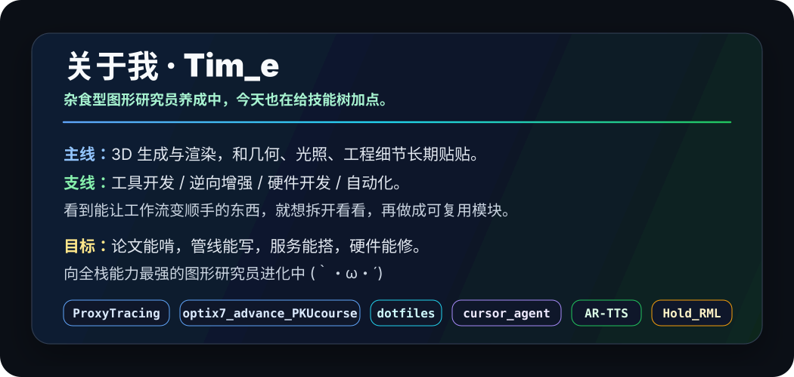
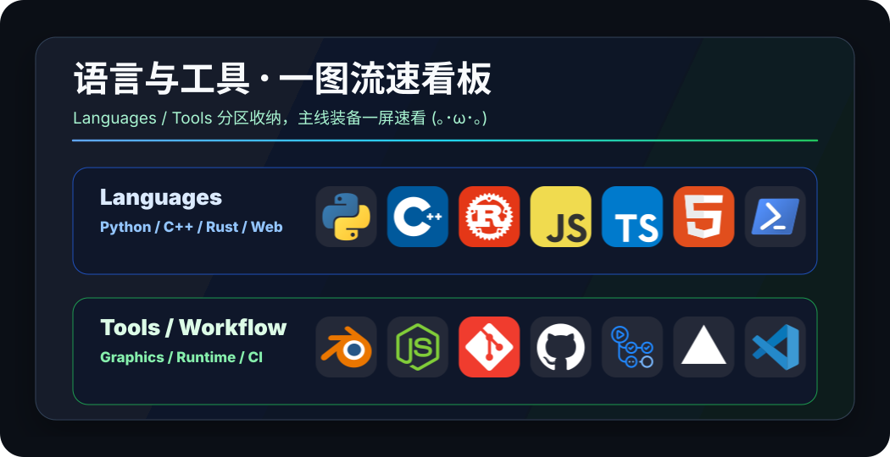
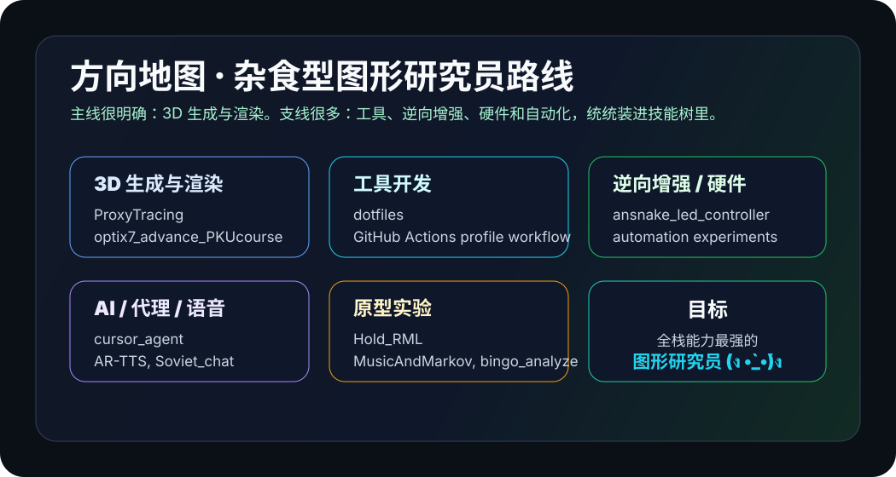

  

  

  
  
  
  
  
  

  

  
  
  
  
  

<h2 id="about">关于我</h2>

  

<h2 id="skills">语言与工具</h2>

  

<h2 id="projects">公开项目</h2>

  
  

  
  

  

<h2 id="stats">GitHub 状态</h2>

  
  

<h2 id="profile-3d">3D 贡献图</h2>

  

<h2 id="activity">最近一个月公开活动</h2>

  

