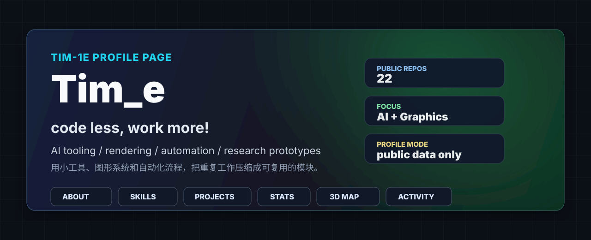
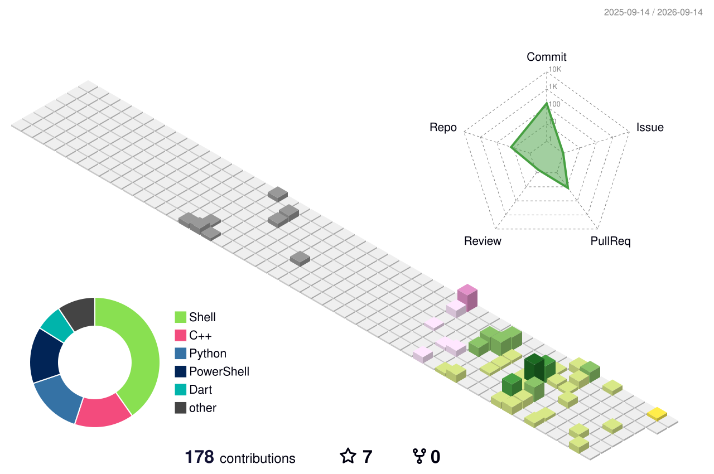

  

  

  
  
  
  
  
  

  
  
  
  

<h2 id="about">关于我</h2>

我是 Tim_e。这个主页只使用 GitHub 公开信息来组织内容，重点展示几个方向：

- **AI tooling**：围绕代理、自动化、代码工作流做小工具。
- **Rendering and graphics**：有 `ProxyTracing`、`optix7_advance_PKUcourse` 等渲染和图形相关项目。
- **Automation**：通过 `dotfiles`、环境配置和 GitHub Actions 把重复工作模块化。
- **Research prototypes**：把研究想法快速落到可运行的小系统里。

> 个人主页目标：把实验性质的项目、技能栈和自动生成的 GitHub 视觉组件组合成一个可长期维护的 profile。

<h2 id="skills">语言与工具</h2>

  

  

<h2 id="projects">公开项目</h2>

  
  

  
  

| 方向 | 公开仓库信号 |
| --- | --- |
| 自动化和环境 | `dotfiles`, GitHub Actions profile workflow |
| 渲染与图形 | `ProxyTracing`, `optix7_advance_PKUcourse` |
| AI / 代理 / 语音 | `cursor_agent`, `AR-TTS`, `Soviet_chat` |
| 原型实验 | `Hold_RML`, `MusicAndMarkov`, `bingo_analyze` |

<h2 id="stats">GitHub 状态</h2>

  
  

<h2 id="profile-3d">3D 贡献图</h2>

  

> 这里使用 `yoshi389111/github-profile-3d-contrib` 的 `profile-season-animate.svg`。首次上传到 `Tim-1e/Tim-1e` 后，需要在 Actions 里运行一次 `GitHub Profile 3D Contrib`，这个占位 SVG 会被真实个人贡献图替换。

<h2 id="activity">最近一个月公开活动</h2>

  

