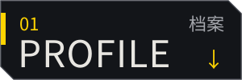
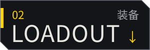
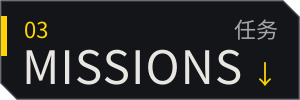
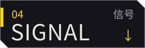
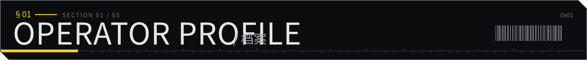
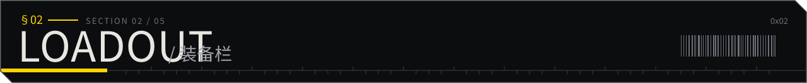
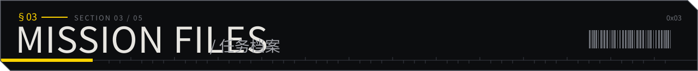
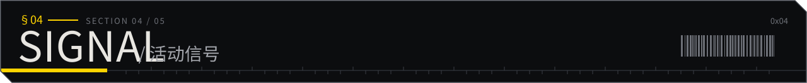
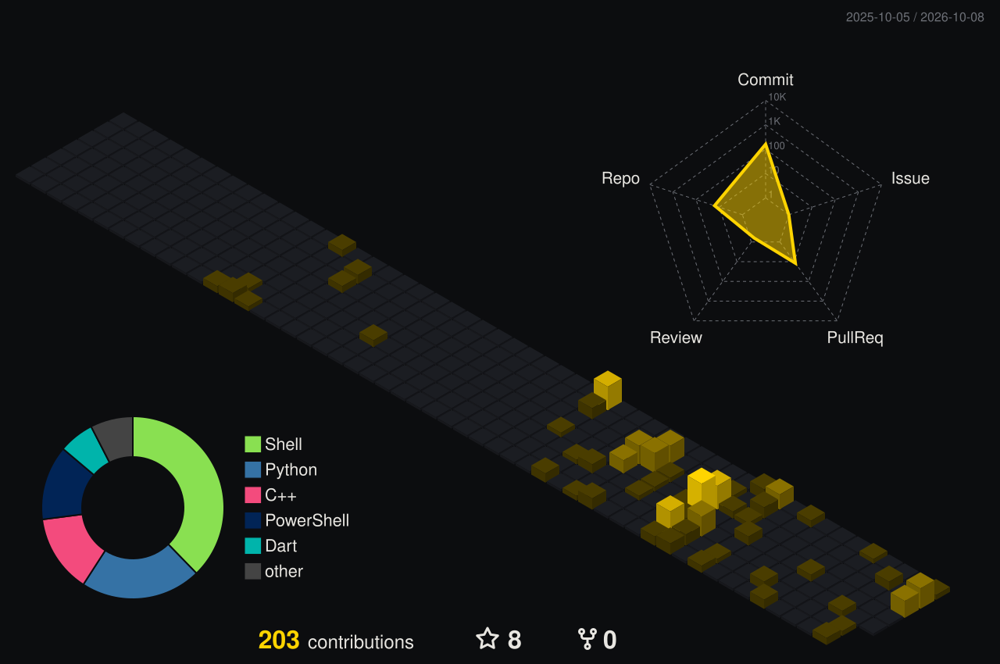
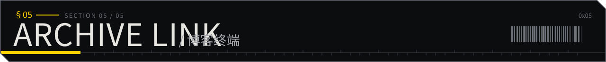

<!--
  TIM-1E // FIELD FILE
  Every panel below is a hand-built SVG: see scripts/ (build_assets.py, render_viewport.py, archive_feed.py).
-->

  

  <a href="#profile"></a>
  <a href="#loadout"></a>
  <a href="#missions"></a>
  <a href="#signal"></a>
  

  
  

  
  

  

  <a href="https://github.com/Tim-1e/Blender-SPCBPT"></a>
  <a href="https://github.com/Tim-1e/optix7_advance_PKUcourse"></a>
  <a href="https://github.com/Tim-1e/ProxyTracing"></a>
  <a href="https://github.com/Tim-1e/holocubic-cli"></a>
  <a href="https://github.com/Tim-1e/cxcc"></a>
  <a href="https://github.com/Tim-1e/CelestialCardArt"></a>

  
    <code>ALSO IN ARCHIVE</code>&nbsp;
    <a href="https://github.com/Tim-1e/codex-reset-guard">codex-reset-guard</a> ·
    <a href="https://github.com/Tim-1e/codex-windows-ssh">codex-windows-ssh</a> ·
    <a href="https://github.com/Tim-1e/dotfiles">dotfiles</a> ·
    <a href="https://github.com/Tim-1e/Hold_RML">Hold_RML</a> ·
    <a href="https://github.com/Tim-1e/AR-TTS">AR-TTS</a> ·
    <a href="https://github.com/Tim-1e?tab=repositories">all repositories ↗</a>
  

  

  
  

  

  

  
  <a href="https://blog.princival.com/"></a>

  
  
  

  

