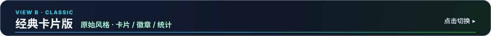
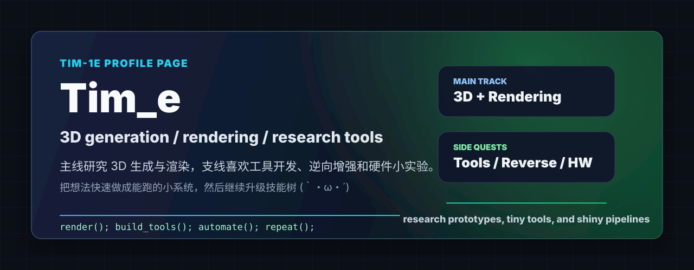
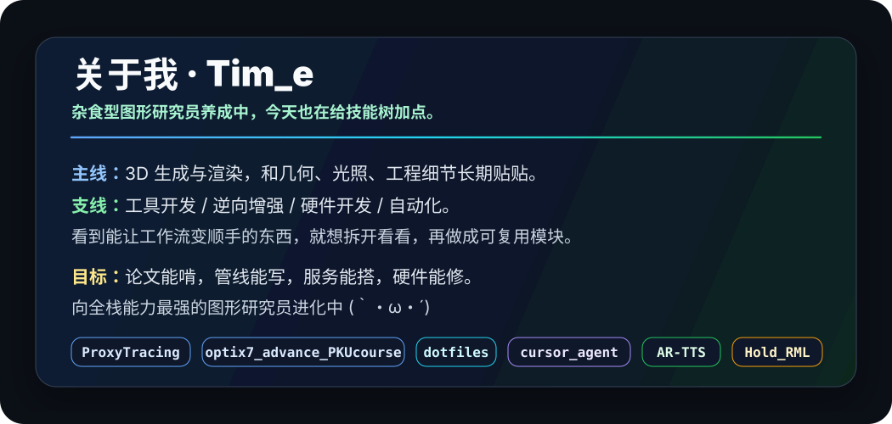
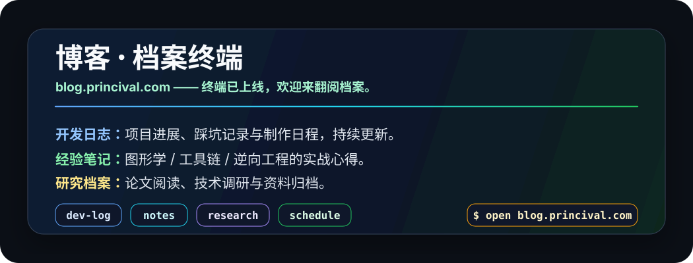
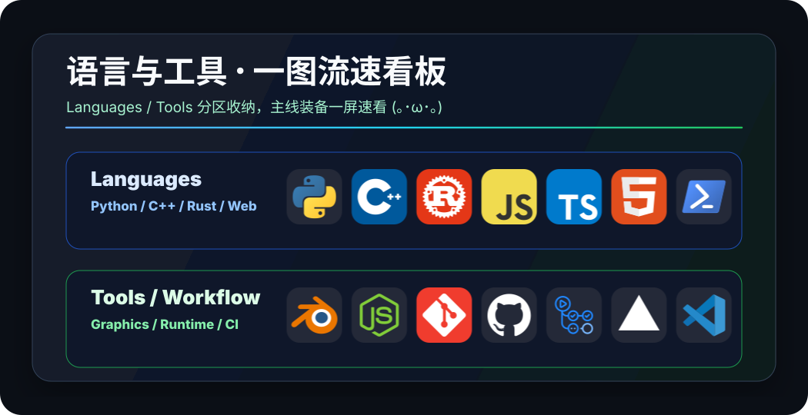
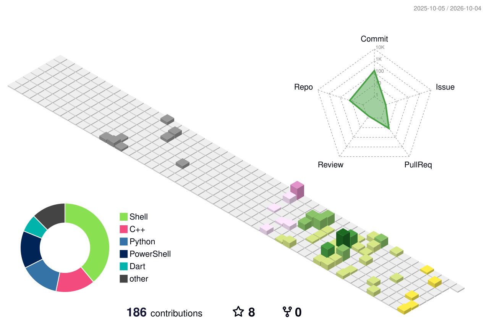

<!--
  TIM-1E profile — two views, switched by the bars below.
  
 makes them exclusive: opening one closes the other (no JS; GitHub keeps the attribute).
  FIELD FILE panels are hand-built SVGs, see scripts/ (build_assets.py, render_viewport.py, archive_feed.py).
  CLASSIC panels live in assets/classic/.
-->

  
  
  

<picture></picture>

  

  

  
  
  
  
  
  

  
  

<h2 id="about">关于我</h2>

  

<h2 id="blog">博客 · 档案终端</h2>

  

<h2 id="skills">语言与工具</h2>

  

<h2 id="stats">GitHub 状态</h2>

  
  

<h2 id="profile-3d">3D 贡献图</h2>

  

<h2 id="activity">最近一个月公开活动</h2>

  

<picture></picture>

  

  
  
  
  
  

  
  

  
  

  
  

  

  
  
  
  
  
  

  
    <code>ALSO IN ARCHIVE</code>&nbsp;
    <a href="https://github.com/Tim-1e/codex-reset-guard">codex-reset-guard</a> ·
    <a href="https://github.com/Tim-1e/codex-windows-ssh">codex-windows-ssh</a> ·
    <a href="https://github.com/Tim-1e/dotfiles">dotfiles</a> ·
    <a href="https://github.com/Tim-1e/Hold_RML">Hold_RML</a> ·
    <a href="https://github.com/Tim-1e/AR-TTS">AR-TTS</a> ·
    <a href="https://github.com/Tim-1e?tab=repositories">all repositories ↗</a>
  

  

  
  

  

  

  
  

  
  

  

